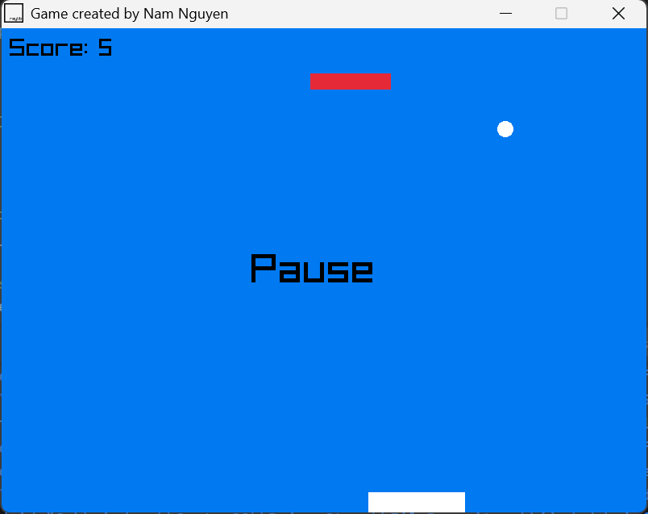
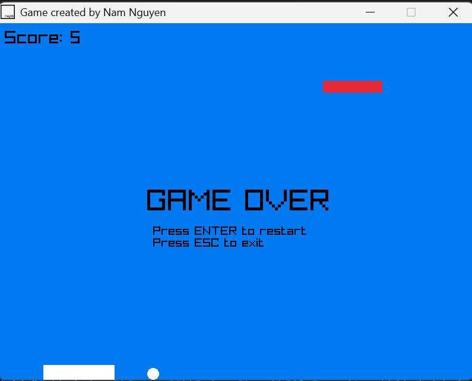

# 🧱 Brick Breaker Game (C++ with raylib)

This is a simple and interactive **Brick Breaker game** developed in **C++ using raylib**.

## Features

- Control the paddle using `←` and `→` arrow keys
- Bouncing ball with simple physics
- A single brick that **relocates randomly** when hit
- `Space` to pause / unpause the game
- `Enter` to restart after Game Over
- `Esc` to quit
- Score counter on screen

---

## Preview

<p align="left">
  
  
</p>

---

## Prerequisites

Before running the game, install the following:

### 1. ✅ Install **Visual Studio Code (VS Code)**

Download and install from: https://code.visualstudio.com/

### 2. ✅ Install the **C/C++ extension** for VS Code

1. Open VS Code
2. Go to the **Extensions panel** (`Ctrl+Shift+X`)
3. Search and install: `C/C++` (by Microsoft)

### 3. ✅ Install **MinGW-w64** (GCC & G++)

1. Download from: [https://www.mingw-w64.org/downloads/](https://www.mingw-w64.org/downloads/)
2. Choose architecture: `x86_64`, threads: `posix`, exception: `seh`
3. Install to `C:\mingw64` (recommended)
4. Add `C:\mingw64\bin` to your **Windows PATH** environment variable
5. Restart your terminal or VS Code

✅ Test it:
```bash
g++ --version
```
### 4. ✅ Install raylib 

Raylib is the graphical C/C++ library used to build and run this game.

Download and install from: https://www.raylib.com/

---

## Steps to run:

1. **Open the file `main.code-workspace` in VS Code**
   - Do **not** just open the folder manually
   - Right-click the `.code-workspace` file and choose “Open with VS Code”

2. Make sure `main.cpp` is open in the editor

3. Press `F5` (or `Fn` + `F5`)

VS Code will:
- Run `make` to compile the game
- Launch `main.exe` in a new window

---

## Author
Created by Nam Nguyen

Inspired by: https://www.youtube.com/watch?v=VLJlTaFvHo4
